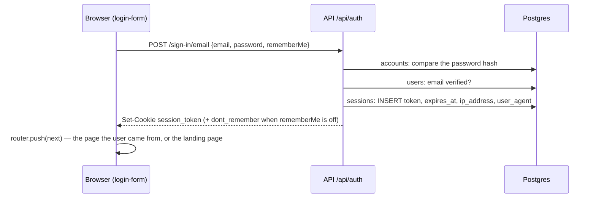

# How authentication works at runtime

What happens when a user signs in, how long they stay signed in, what ends a session, and what the
browser, the web server and the API each do. Why Better Auth was chosen: `adr/0002-auth.md`. Who may
do what once signed in: `../.claude/rules/permissions.md`. How to call Better Auth from code:
`../.claude/skills/better-auth/SKILL.md`. Cookie scope and CORS settings: `conventions.md`
(Authentication and sessions).

## The pieces

- Better Auth 1.7.3 runs inside the API (`apps/api`) at `/api/auth/*`, configured once in
  `packages/auth/src/server.ts` (`createAuth`). It stores users, sessions, credential accounts and
  one-time tokens in our Postgres tables `users`, `sessions`, `accounts`, `verifications`.
- **There is no JWT and no refresh token.** A signed-in device is a row in `sessions`. The browser
  holds only that row's random token, in a cookie the API sets: `better-auth.session_token`
  (`__Secure-better-auth.session_token` when the API runs on https), HTTP-only, `SameSite=Lax`,
  signed with `BETTER_AUTH_SECRET`. JavaScript never sees it.
- The web app (`apps/web`) is a client of the API. In the browser `authClient`
  (`apps/web/lib/auth/client.ts`) calls `/api/auth/*` with `credentials: "include"`; on the server,
  `getServerSession` (`apps/web/lib/auth/server.ts`) forwards the incoming `cookie` header to
  `/api/auth/get-session`.

## Signing in

The sign-in endpoint refuses a wrong email or password with one message
(`INVALID_EMAIL_OR_PASSWORD`, so it never says which one), a deactivated user (`BANNED_USER`) and an
unverified address (`EMAIL_NOT_VERIFIED`; an invited user is verified by setting the first password,
see below). The web shows these in Japanese through `authErrorMessage`
(`apps/web/features/auth/auth-errors.ts`).

## Every request after that

- **API.** `buildRequestContext` (`apps/api/src/core/context.ts`) calls `auth.api.getSession` once
  per request: one query loads the session row with its user, and the `customSession` plugin runs
  one more for the user's effective grants (ADR 0003). The result is `ctx.user` and `ctx.ability`;
  services never ask Better Auth who the caller is. Nothing is cached, so a role or grant change
  applies on the very next request, and a revoked session is refused immediately.
- **Web.** Three checks, each thinner than the next one behind it: `proxy.ts` redirects to
  `/login?next=<path>` when the request carries **no** session cookie (presence only, no network
  call); `app/admin/layout.tsx` asks the API for the session on every request and redirects to
  `/login` when there is none; `PageGuard` on every page applies the ability. The API re-checks
  everything.

## How long a session lives

The login form's「ログイン状態を保持する」checkbox is Better Auth's `rememberMe`:

| Checkbox       | On (default)                                                                                                                       | Off                                                  |
| -------------- | ---------------------------------------------------------------------------------------------------------------------------------- | ---------------------------------------------------- |
| `sessions` row | 7 days (`session.expiresIn`)                                                                                                       | 24 hours (fixed by Better Auth)                      |
| Cookie         | `Max-Age` 7 days, survives closing the browser                                                                                     | No `Max-Age`: gone when the browser closes¹          |
| Sliding        | Yes: once a session is at least 1 day old (`updateAge`), the next request pushes `expires_at` 7 days ahead and re-sends the cookie | Never                                                |
| In practice    | A user who comes back at least once a week never signs in again; 7 days of silence signs them out                                  | Signed out 24 hours after signing in, however active |

¹ A browser set to restore its previous tabs keeps session cookies; the 24-hour row is then the only
limit.

A refresh changes `expires_at` and `updated_at` only; the token in the cookie stays the same for the
life of the session.

## What ends a session

| Cause                                        | Effect                                                                                                                                                     |
| -------------------------------------------- | ---------------------------------------------------------------------------------------------------------------------------------------------------------- |
| Expiry                                       | The next `get-session` deletes the row and clears the cookie; protected tRPC procedures answer `UNAUTHORIZED`; the next page navigation lands on `/login`. |
| ログアウト (`authClient.signOut`)            | That device's row is deleted and its cookie cleared.                                                                                                       |
| Password change on `/admin/profile`          | `revokeOtherSessions: true`: every other device signs out; the current browser stays signed in.                                                            |
| Password set or reset from a mailed link     | `revokeSessionsOnPasswordReset`: every device signs out, including the one that used the link.                                                             |
| Deactivation by an admin (`user.deactivate`) | The user repository deletes all of the user's `sessions` rows in the soft-delete transaction.                                                              |
| Rotating `BETTER_AUTH_SECRET`                | Every cookie's signature stops verifying: everyone signs in again (the rows stay until they expire).                                                       |

Two things to know about expiry in the browser:

- Nothing in the web app listens for `UNAUTHORIZED`. A page left open past expiry shows an error on
  the next action; the redirect to `/login` happens only on the next navigation.
- Only `proxy.ts` adds `?next=`. When the cookie is still present but the row is gone (checkbox off
  after 24 hours, or any revocation above), the layout redirects to `/login` without `next`, so the
  user lands on the landing page instead of where they were.

## Several devices

- A user may be signed in on any number of devices at once: each sign-in is its own `sessions` row
  with its own token, `ip_address`, `user_agent`, `created_at` and `expires_at`. One device signing
  out does not affect the others.
- Better Auth already serves `GET /api/auth/list-sessions`, `POST /revoke-session` and
  `POST /revoke-other-sessions` (`authClient.listSessions()`, `revokeSession({ token })`,
  `revokeOtherSessions()`). `list-sessions` requires a _fresh_ session: one created less than
  `session.freshAge` ago (Better Auth's default is 24 hours; we do not set it), otherwise it answers
  403 `SESSION_NOT_FRESH`. A "signed-in devices" screen must set `freshAge` (0 disables the check)
  or ask the user to sign in again first. There is no such screen yet.

## Password links: invitation, forgot password, reset

One mechanism, Better Auth's password-reset token, serves three entry points: `user.invite` (an
admin creates a user with no password), `/forgot-password` in the web, and the admin's re-send on
the user page (`user.sendPasswordReset`).

1. `requestPasswordReset` stores a random single-use token valid **1 hour**
   (`resetPasswordTokenExpiresIn`) and calls `sendResetPassword`, which writes an outbox mail
   (`account-invitation` while the user has no credential account, `password-reset` otherwise,
   nothing for a deactivated user). A new request does not invalidate an earlier unexpired link. The
   endpoint answers the same for known and unknown addresses.
2. The mailed link is `${API_URL}/api/auth/reset-password/<token>?callbackURL=<web>/new-password`.
   Better Auth checks the token and redirects to `/new-password?token=…`, or
   `/new-password?error=INVALID_TOKEN` when it expired or was already used.
3. `/new-password` submits `resetPassword({ newPassword, token })`. The password policy
   (`passwordSchema` in `@repo/validation`: 8–128 characters, a letter and a digit) is checked by
   the form and again by a Better Auth `hooks.before` middleware on every endpoint that stores a
   password. On success every session of the user is revoked and the email is marked verified: using
   the mailed link proves the mailbox, which is how an invited user becomes able to sign in.

## Rate limits (`apps/api/src/middleware/rate-limit.ts`, per client IP, Redis)

| Path                               | Allowed                | Then                                       |
| ---------------------------------- | ---------------------- | ------------------------------------------ |
| `/api/auth/sign-in/*`              | 10 attempts per minute | 429 with `Retry-After`, blocked for 60 s   |
| `/api/auth/request-password-reset` | 5 requests per 15 min  | 429 with `Retry-After`, blocked for 15 min |

## Known gaps

Facts about today's code, not decisions; each would be its own ticket.

1. No "signed-in devices" screen (see Several devices; `freshAge` must be decided first).
2. No browser-side handling of `UNAUTHORIZED` from tRPC (the user sees an error until the next
   navigation).
3. The expired-session redirect loses `?next=` when the cookie is still present (see What ends a
   session).
4. Better Auth's own `/api/auth/admin/*` endpoints (`set-role`, `ban-user`, `remove-user`,
   `set-user-password`, `impersonate-user`, `revoke-user-sessions`, …) are open over HTTP to every
   `admin` and `super_admin`, gated by the admin plugin's role map alone: our service rules
   (last-admin protection, `DENY` grants) do not apply there. ADR 0003 records a `hooks.before` on
   `/admin/*` as the follow-up.
5. Expired `sessions` rows are deleted only when their own cookie comes back; rows of abandoned
   devices stay until something sweeps them. There is no sweeper.
6. The effective-grants query runs on every request; a Redis cache is the planned follow-up (ADR
   0003).
